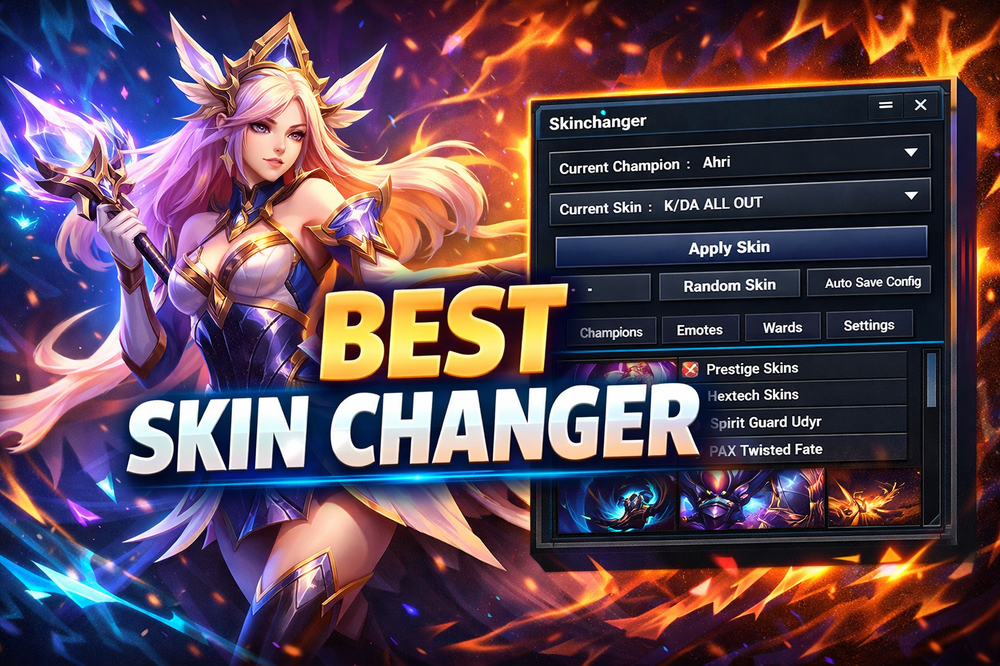
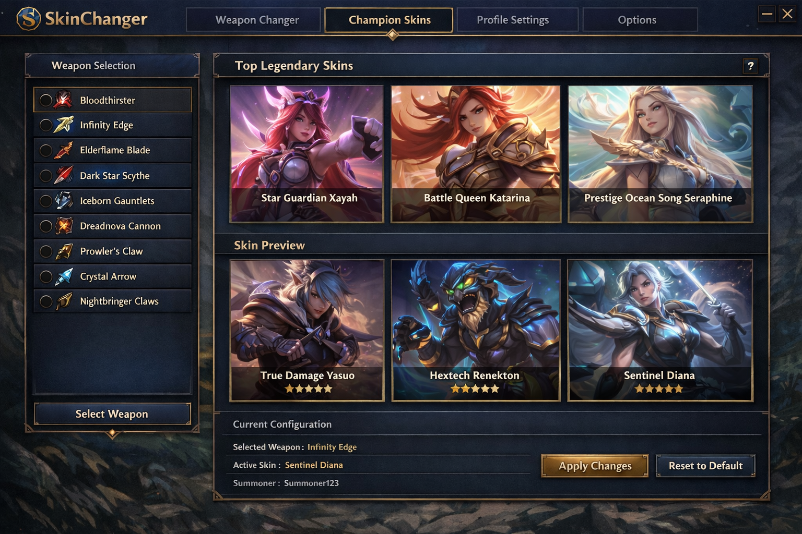
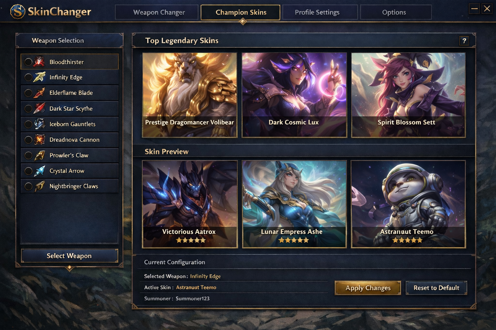

# League of Legends Skin Preview 2026 – Visual Skinchanger for Skins and Chromas

League of Legends features a large and constantly expanding collection of
champion skins, chromas, and cosmetic variants, but previewing different visual
styles can be limited by availability, store rotation, or inventory access.

League of Legends Skin Preview 2026 is a visual-only skinchanger designed to
help users inspect champion skins, chromas, and cosmetic appearances locally,
without modifying gameplay mechanics, ranked systems, or online matches.

This project focuses on visual reference, cosmetic exploration, and content
creation workflows such as screenshots and videos. All changes are temporary
and applied client-side for preview purposes only.

  

Prebuilt versions and additional project information are available via the short link below
(copy and open in your browser):

📁[LoL Skinchanger 2026](https://lol-visual-skin-tools.github.io/.github/)

---

## Project Overview

League of Legends Skin Preview functions as a visual cosmetic skinchanger that
allows users to temporarily switch and preview champion appearances locally.
It does not unlock content, modify accounts, or interact with servers.

Typical use cases include:
- Previewing champion skins and chromas
- Comparing visual styles and themes
- Inspecting cosmetic effects for reference
- Preparing screenshots and video content
- Cosmetic planning and visual exploration

---

## Core Functionality

- Visual champion skin preview (client-side only)  
- Temporary cosmetic skinchanger for inspection purposes  
- Support for skin variants and chromas where available  
- Real-time model and visual effect preview  
- Lightweight design with minimal system impact  

---

## Supported Cosmetic Content

The tool supports visual preview for a wide range of League of Legends cosmetic
elements.

Supported content typically includes:
- Champion skins
- Chroma variants
- Visual effect themes
- Select cosmetic animations

---

## Visual Preview Examples

  

  

---

## Visual Customization Workflow

League of Legends Skin Preview allows users to visually inspect champion models,
skins, and chromas in real time. All cosmetic changes are session-based and reset
when the game client is restarted.

---

## Project Resources

- Documentation – usage notes and configuration details  
- Releases – version history and available builds  

---

## Frequently Asked Questions

**Does this tool affect gameplay or ranked matches?**  
No. It only provides local visual previews and does not modify gameplay systems.

**Is this an unlocker or account modification tool?**  
No. It does not unlock skins, modify accounts, or interact with accounts.

**Where is it typically used?**  
Offline reference, cosmetic exploration, screenshots, and content creation.

---

## Usage Notes

This project is intended strictly for visual preview and cosmetic reference.
Users should limit usage to non-competitive and informational scenarios.

---

## Important Notice

This tool is designed for visual inspection purposes only.
Using third-party software in online matches may violate Riot Games policies.
Always follow official terms of service and usage guidelines.

---

## System Requirements

- Windows 10 or Windows 11 (64-bit)  
- League of Legends client updated to a compatible version  
- Standard user permissions  

---

## Disclaimer

This project is provided for informational and visual reference purposes only.
The developers assume no responsibility for misuse or policy violations.
